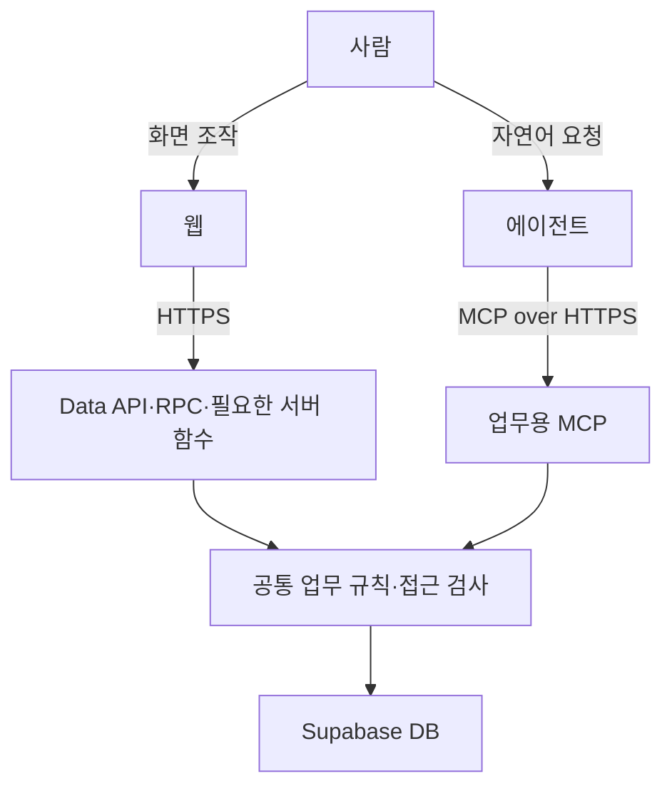

# 공동 업무 앱의 기술 구성과 완료 근거

## 기본 구성

| 역할 | 출발점 |
| --- | --- |
| 웹 | React·Vite·Tailwind CSS |
| 인증·저장·권한 | Supabase Auth·Postgres·RLS, 필요한 RPC |
| 서버 처리·업무용 MCP | Deno 기반 Supabase Edge Functions |
| 검사 | Vitest·DB/서버 계약 검사·Playwright·실제 에이전트 클라이언트 |
| 배포 | GitHub Actions에서 검사 후 GitHub Pages에 웹 배포, DB 변경·Edge Functions는 Supabase에 별도 적용 |

초기 기준은 Node.js 22, React 19, Vite 8, Tailwind 4, Deno 2다. 구현 시 지원과 호환성을 확인해 버전을 선택하고 기록한다. 기존 프로젝트와 사용자의 선택에 맞춰 조정한다.

이 그림은 책임을 설명한다. 공통 규칙은 필요한 RPC나 서버 함수에서 구현하고, 각 상자를 별도 서버나 계층으로 만들지는 않아도 된다. 웹과 MCP가 같은 자료와 업무 규칙을 사용하도록 설계한다. 외부 API·웹 수집이 필요하면 서버 처리에 연결하고 출처·갱신 시점·실패 상태를 다룬다.

## 인증과 에이전트 사용

웹 로그인과 에이전트가 사용자 대신 작업하도록 허용하는 OAuth 연결 동의를 구분한다. 사용할 에이전트 클라이언트의 원격 MCP·인증 지원과 접속 가능한 주소를 초기에 확인해 최소 조회부터 연결한다. Supabase OAuth 설정은 [공식 MCP 인증 안내](https://supabase.com/docs/guides/auth/oauth-server/mcp-authentication)를 구현 시 확인한다.

서버는 검증된 사용자 문맥으로 DB에 접근하고 사용자·팀 정책과 MCP 허용 범위를 함께 적용한다. MCP 호출을 일괄 관리자 권한으로 실행하지 않는다. 같은 사용자라도 연결에 부여한 범위에 따라 에이전트가 할 수 있는 일은 더 좁을 수 있다.

MCP 도구는 조회·상태 변경처럼 의미 있는 업무 동작을 제공한다. 입력·결과·오류가 명확해야 에이전트가 자연어 요청에 맞는 도구를 선택하고 실제 결과를 설명할 수 있다. 개발 에이전트의 작업 지침과 서비스 이용 에이전트에 전달되는 도구 설명·사용 안내를 구별하고, 기능 변경 때 실제 공개되는 도구 계약도 갱신한다. 조회·제안과 실제 저장을 구분하며 모호한 대상이나 중요한 변경의 확인 방식은 업무 특성에 맞춰 설계한다.

## 기능 구현과 구조 정리

첫 업무의 웹 조작과 자연어 요청이 끝까지 연결되는 작은 단위로 개발한다. 에이전트는 요청 해석과 설명을, 서버는 권한·저장·중요 계산을 맡는다. 부분 저장·중복 실행·동시 수정으로 업무가 잘못될 수 있는 작업은 서버에서 보호한다. 화면은 공통 컴포넌트를 활용하고 실제 사용할 모바일·PC 환경과 접근성을 고려한다.

테이블·상태·이력·공통 계층은 현재 업무에 필요한 만큼 둔다. 같은 자료의 기준 저장 위치를 하나로 정하고, 과거 구현이 있다는 이유만으로 불필요한 구조를 유지하지 않는다. 기능을 줄이거나 통합할 때는 화면·API·MCP·저장 구조와 설명을 함께 검토한다.

변경 티켓에는 기존 동작과 바꿀 범위를 바탕으로 재사용할 부분, 바꿀 부분, 제거할 부분을 짧게 남긴다. 새 경로가 기존 경로를 대체하면 관련 호출과 중복 규칙도 정리하고 영향받는 동작을 검증한다. 적용된 DB 이력과 업무 데이터는 보존하며 변경하고, 작업 범위를 넘는 구조 문제는 영향과 후속 작업을 기록한다.

## 배포와 실제 사용

웹은 GitHub Pages의 정적 파일로 배포하고 서버 함수와 MCP는 Supabase에서 운영한다. 웹 앱의 배포 경로에 맞춰 Vite의 자산 경로와 화면 이동을 설정하고, 실제 Pages 주소를 로그인 리다이렉트 설정에 반영한다. GitHub Actions의 웹 게시가 DB 변경이나 Edge Function까지 적용하지는 않는다. 서버 변경을 먼저 호환되는 상태로 적용한 뒤 웹 배포 전 검사에서 대상 서버와 맞는지 확인한다. 기존 서비스는 복구를 고려해 적용 순서를 정한다. 배포 범위와 결과는 티켓으로 추적한다.

CI에서는 변경에 맞는 코드·DB·MCP 계약·브라우저 검사를 웹 게시의 조건으로 삼는다. 초기화나 쓰기를 수반하는 검사는 격리 환경에서 수행하고, 운영 서버와의 호환성 확인은 허용된 범위에서 진행한다. 완료 근거는 대표 업무에 맞춰 확보한다.

- 웹에서 저장·재조회한 자료를 실제 에이전트에게 자연어로 물어보고, 허용된 결과를 받는다.
- 쓰기를 제공한다면 양쪽에서 생성·수정·삭제한 결과를 다른 경로에서도 확인한다. 지원 범위의 중요한 필드와 조회 누락도 살핀다.
- 다른 구성원의 계정으로 공동 작업과 권한 거부가 의도대로 동작한다.
- 업무에 중요한 실패·중복·권한 변경 상황을 확인한다.

이용자에게는 웹 주소, 에이전트 연결 방법, 사용할 수 있는 업무와 요청 예시를 전한다. 배포 기록에는 앱 커밋과 적용한 DB·함수 버전, 확인 결과를 연결하고 장애 시 확인할 로그와 복구 방법을 남긴다. 웹을 되돌려도 DB가 함께 복구되는 것은 아니다. 로컬 검사·배포·실제 사용 확인을 구별하고, 확인하지 못한 경로는 남은 작업으로 기록한다.
